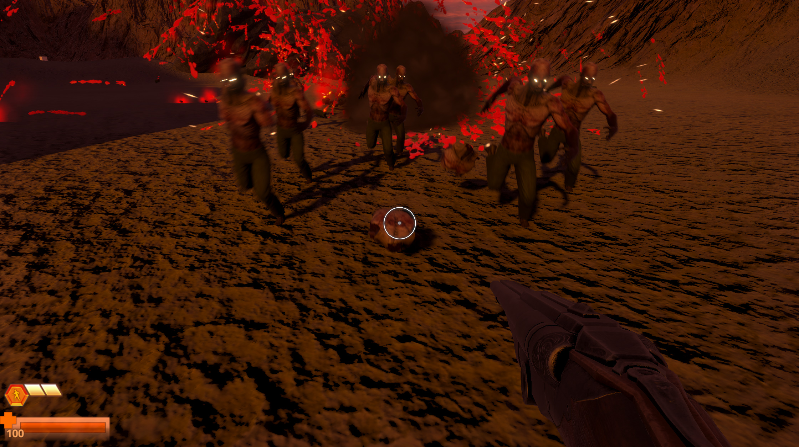
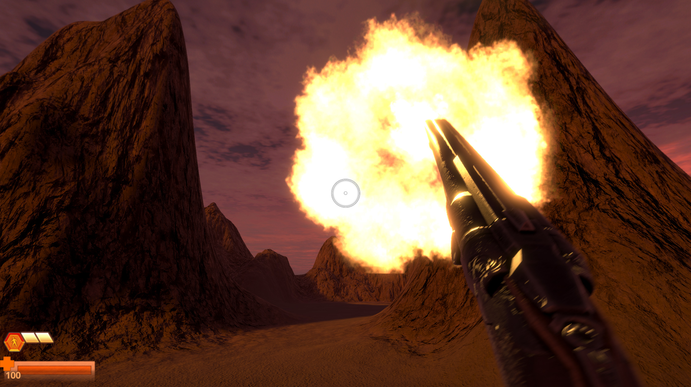
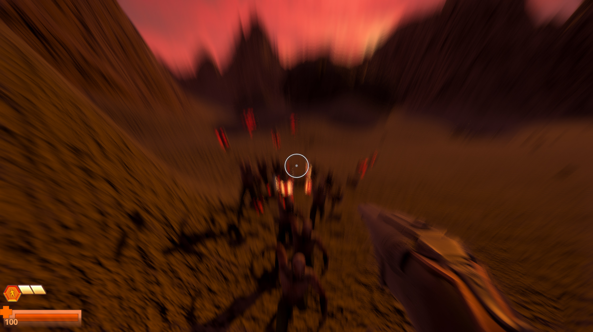

[(참고: 마크다운 사용 법)](https://gist.github.com/ihoneymon/652be052a0727ad59601)

# [팀 이름]
아레나(Arena)
## [ 팀 구성원 ]
김 용 현 (개인작업)
## 프로젝트 사용할 Repo 링크
https://github.com/zi0808/RipArena
(현재는 Private 로 설정됨.)

# 게임 컨셉 제안서
본인이 좋아하는 게임인 둠(DooM) 시리즈를 참고하였다.
이 게임에는 스토리나 설명 같은것도 딱히 없으며,
그저 몰려오는 적을 쏘고, 적에게 당하는것을 피하며
전투를 이어나가는 매우 단순한 게임이다.
=====
그 대신 "타격감" 을 호쾌하게 만들고 있고,
모티브로 삼은 둠 시리즈 처럼,
그 간단함으로도 재미를 만들어 내는것을 목표로 하고 있다.
## 게임을 한마디로 표현하면?
움직이는 것이 보이면 쏴버리면 된다.
### 장르와 대상 연령층
FPS (일인칭 슈팅) / 18세 이상 성인
## 게임의 시스템

* **부위별 피해 판정 / 파괴** |
적군 캐릭터들이 부위별로 충돌체를 가지고 있고, 어느 부위를 어떻게 타격하느냐에 따라 다른 반응이 나올 수 있다.
( 예 : 팔을 쏘면, 좀비의 팔이 떨어져 나가 공격력이 떨어진다. 머리를 쏘면 한번에 죽는다. )

또한, 폭발물이나 강력한 무기를 사용하면, 적을 산산히 분해 해버리는 등 타격감을 높여줄 시각 및 물리 효과를 보여준다.

* **무기 시스템** |
실탄형 총, 폭발물을 발사하는 발사기 등 여러 무기를 다루고, 위의 부위별 피해/파괴 시스템과 연결하여
무기마다 다른 효과를 볼수 있도록 계획중이며, 여러 타입을 조합하는것도 가능.
( 예 : 폭발탄을 쏘는 산탄총 )

* **다양한 이동 방법** |
플레이어는 더블 점프, 무중력 대쉬 등과 같은 이동 스킬을 통해 적군을 회피하거나 
빠른 이동이 가능하다. 또한 고전 FPS 의 특성을 차용하여, 항상 빠른 속도로 이동하고
따로 속도를 변경하는 "스프린트" 키를 두지 않는다.
### 핵심 재미
게임의 흐름 자체는 매우 단순하지만, 적군 캐릭터에는 부위파괴 등
타격감을 확실하게 느낄수 있는 요소를 적용하여 스릴을 느끼는것을 목표한다.

다만 장르 특성상, 모두에게 재미를 주지는 못할 수 있다.
이 게임을 가장 크게 즐길수 있는 대상은 FPS 내지는 슈팅 게임을 좋아하는 사람들이 될 것이라고 보고 있다.

